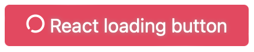

<p align="center">
  <a href="" rel="noopener">
 </a>
</p>

<h2 align="center">React Loading Button</h2>

---

<div align="center">

[](#)
[](https://github.com/girishsawant999/react-package-template/issues)
[](https://github.com/girishsawant999/react-package-template/pulls)

[](#)
[](/LICENSE)

</div>

---

<p align="center">
A small react loading button component for getting flexibility to show other content instead of full screen loader while submitting API request.
</p>

## 📝 Usage

Just install the package using command

```
npm install @girishsawant999/react-loading-button
```

And then import component in your react app

```javascript
import Button from '@girishsawant999/react-loading-button';

// Use Button Component

<Button loading={isLoading}>Loading Button</Button>;
```

That's all and you are ready to go.
