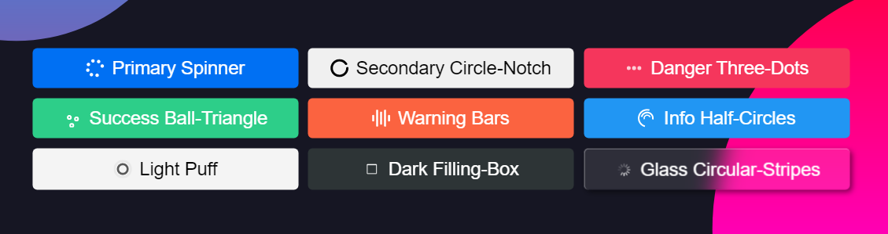

<p align="center">
  <a href="https://girishsawant999.github.io/react-loading-button/" rel="noopener">
 </a>
</p>

<h2 align="center">React Loading Button</h2>

<div align="center">

[](#)
[](https://github.com/girishsawant999/react-loading-button/issues)
[](https://github.com/girishsawant999/react-loading-button/pulls)

[](https://github.com/girishsawant999/react-loading-button/actions)
[](/LICENSE)

</div>

---

<p align="center">
A small react loading button component for getting flexibility to show other content instead of full screen loader while submitting API request.
</p>

<p align="center">
  <a href="https://girishsawant999.github.io/react-loading-button/" target="_blank">
    React loading Button Playground
  </a>
</p>

## 📝 Usage

Just install the package using command

```
npm install @girishsawant999/react-loading-button
```

And then import component in your react app

```javascript
import Button from '@girishsawant999/react-loading-button';

// Use Button Component

<Button loading={isLoading}>Loading Button</Button>;
```

That's all and you are ready to go.

## 📃 Props

| Prop       | Types                                                                                                                                              | Description                                                 |
| ---------- | -------------------------------------------------------------------------------------------------------------------------------------------------- | ----------------------------------------------------------- |
| loading    | Boolean<br>Default: `false`                                                                                                                        | Added loader in button when value is `true`                 |
| buttonType | `primary`, `secondary`, `danger`, `success`, `warning`, `info`, `light`, `dark`, `glass`<br/>Default: `primary`                                    | Set type of layout to button you can check it on playground |
| loader     | `spinner`, `circle-notch`, `three-dots`, `ball-triangle`, `bars`, `filling-box`, `puff`, `half-circles`, `circular-stripes`<br/>Default: `spinner` | Set type of loader in button while loading                  |

Additionally you can pass any other props to button
